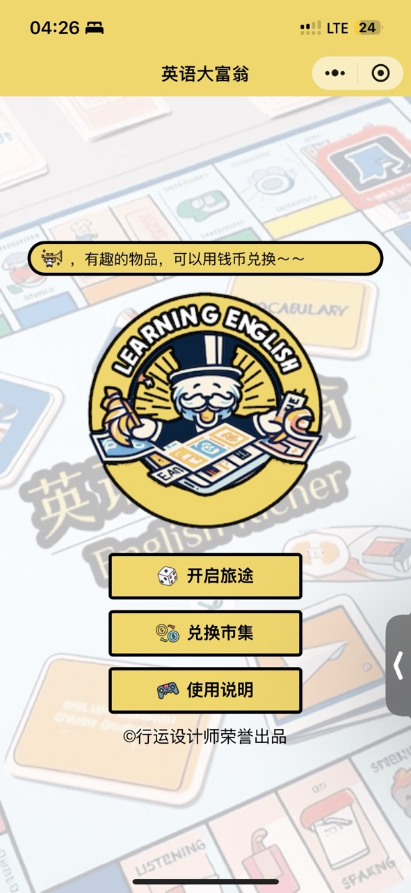
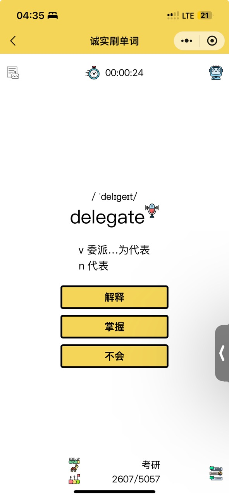
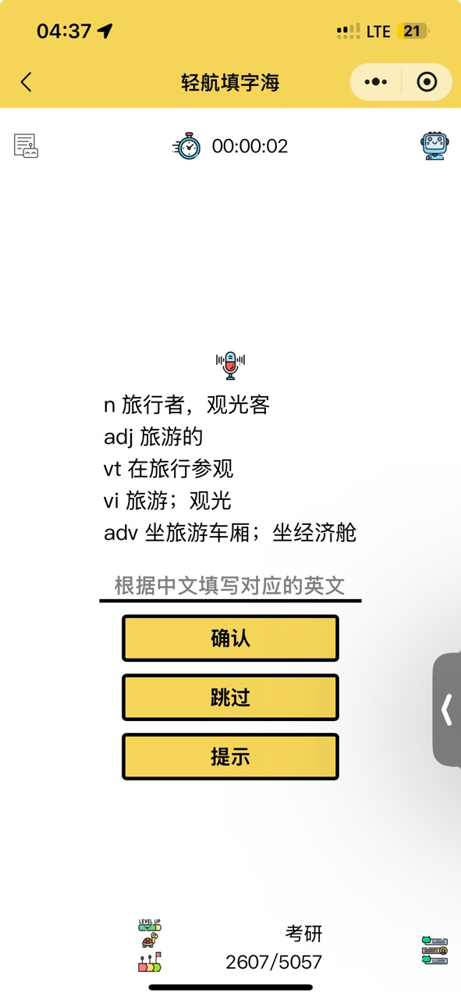
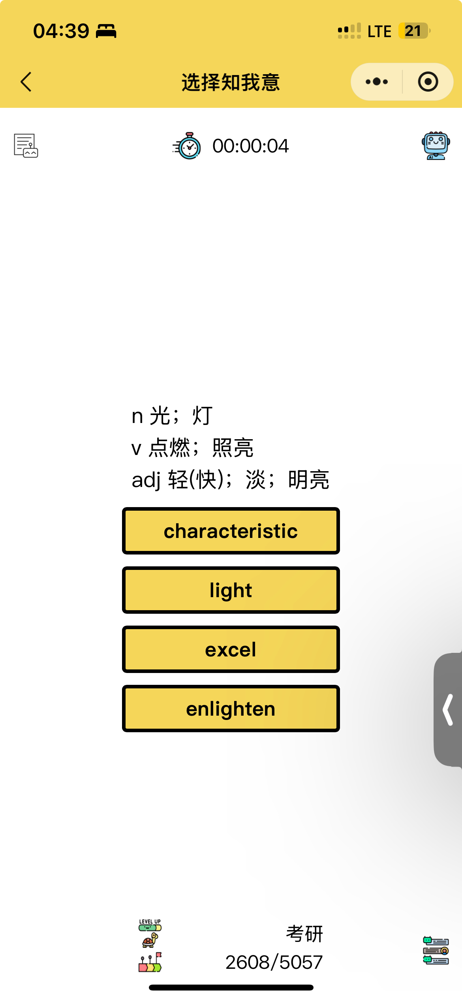
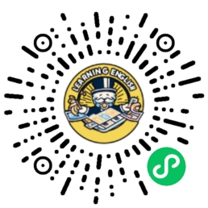

# 英语大富翁
一款有趣，有料，有深度的微信小程序，目标群体是想要提高英语水平的用户，帮助用户牢记单词，同时收获财富，通过财富兑换相关物品，即获得即所得，使用微信小游戏开发工具开发。

### 小程序封面截图

### 设计思路
我在我设计的财富增值攻略系统中，有一个头脑风暴，也就是思维导图，用它来梳理英语大富翁的设计思路，想到一个好点子就加进去。

### 功能介绍
英语大富翁是一个帮助用户学习英语的小程序，主要用来提升用户的词汇量，包含等级为小学、初中、高中、大学英语四级、大学英语六级、考研、托福和 SAT 等。

目前分为三关，第一关名为《诚实刷单词》，根据用户设置的难度等级进行刷单词，如果会就点击“掌握”，如果不会就点击“不会”。解释处于隐藏状态，当用户点击解释按钮后，可以看到，帮助用户理解词义，同时每掌握一个就收获对应的经验值和财富。

第二关，需要达到 3 级后方可开启，该关卡进入后会给出中文，然后需要用户填写对应的英文单词，答对即可加载下一个，不会的话该单词直接进入温故知新，方便以后查询，当然，答对后也会收获对应的经验值和财富。

第三关，名字叫做选择知我意，玩法为出现中文解释后，从四个单词中选出一个正确答案。

当你的财富增长到一定水平后，就可以在首页交换情报选项进行兑换，目前开设了四个兑换，分别是免费离线GPT4，雅思复习资料，随机电影字幕以及话费优惠信息，以后会陆续添加新的福利。

可以通过兑换彩票和经验卡，随机获得金钱和经验。

在开始旅途页面，右上角有个齿轮作为设置页面进入项，可以进行修改昵称，修改水平，查看更新历史，查看作者信息，查看单词词库等，其中的温故知新是不会的单词集合，方便用户查看。

目前基本上是这样，后续有新的功能发布会继续更新到这里。

引入了 AI 功能，可以获得联想功能，AI 详解，以及 AI 畅聊更好的加深理解，加速记住单词。

### 微信扫一扫试用

 
